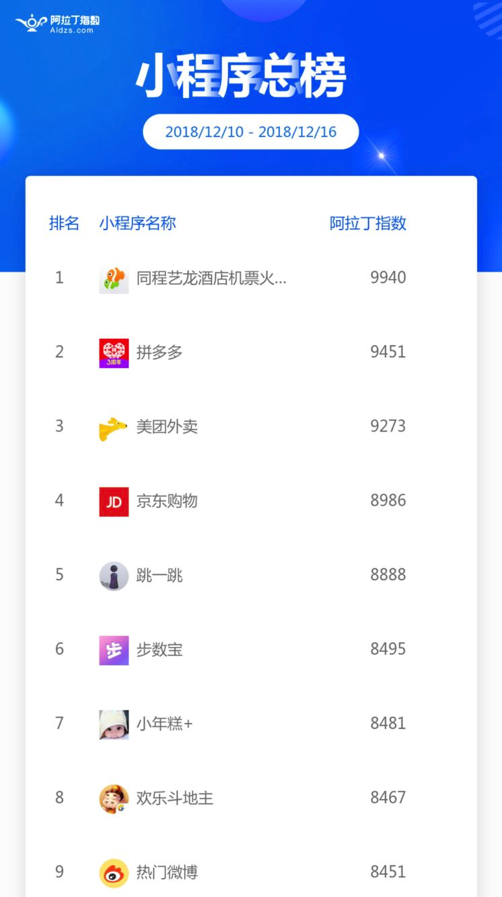

# 珠峰年底冲刺 全新小程序课程

## 小程序数量超百万，日活用户已达2亿！
在今年第五届世界互联网大会上，腾讯CEO马化腾在下午的科技成果发布展上公布了微信小程序的最新数据：

“目前，有150万开发者加入小程序开发生态，小程序应用数量超过100万，覆盖200个细分行业，日活达2亿，目前已在很多城市支持地铁公交服务，有400万广东用户通过“粤省事”小程序办理100多项民生服务。”

## 各大互联网公司纷纷入局小程序 抢占流量入口
  小程序已经成为一种趋势，目前我们手机上经常使用的工具类APP，都有自己对应的小程序，例如拼多多、爱奇艺视频、美团外卖、滴滴出行、携程……用户无需下载这些APP，就能使用所有服务，所以用户的行为习惯将很快都转移到小程序上面，这是一种不可逆的趋势。

  同时百度、支付宝和头条等先后进入小程序领域，这也说明小程序已经成为互联网下半场的竞争方向之一。

### 阿拉丁小程序一周总榜

#### 微信小程序对互联网公司的价值是什么？

1、更低的创业门槛,更低的接入成本；

2、产品的开发迭代率更快,效率更高；

3、获客成本低，更容易获取种子用户；

4、更简单的运营模式，投入回报率更高

5、微信小程序的流量入口有60多个

#### 小程序为什么火？
1、海量的用户基数（第三季度微信月活跃用户数10.83亿）

2、超高的使用频率

3、原生体验的移动应用

4、一次开发，多端共享（安卓，IOS不需要分别开发）

5、不需要下载

6、速度快（代码存放在腾讯云里）

## “小程序员”的诞生

 小程序获选”世界互联网领先科技成果”。发布会上，腾讯公司董事会主席兼首席执行官马化腾作为腾讯公司代表上台领奖并发表主题演讲。

 

 “小程序是那么多年来，中国IT行业里，一个真正能够影响到普通程序员的创新成果。”马化腾表示，看到大家都在学习和使用小程序，以及很多专门的“小程序员”的诞生，他感到十分激动和自豪。他还表示，小程序打破了过去受限的开发环境，构建出一个新的开发环境和开发者生态，为“跨系统开发”这个世界难题给出了中国的解决方案。”

### 小程序开发招聘需求 不断扩大
  随着小程序生态的逐渐形成，小程序已经深入我们生活的各个场景。门槛低、更易学、对个人开发者更加包容开放的特点也吸引了越来越多的人加入到“小程序程序员”的行列。各大公司对小程序开发人员需求也在不断增长。

 

## 珠峰培训年底推出 - 全新小程序系列课程
在2019即将来临之际，珠峰培训多年前端开发经验的美女老师海英，为大家准备**2019全新小程序课程套餐** 带你刷一波。 特邀您一起来入局小程序。全方位的指导、在线问题解答、为期三周的学习，后期持续更新课程。

### 微信小程序课程大纲（后期持续更新）
#### 1. 入门
- 1.1 小程序介绍
- 1.2 小程序开发流程
- 1.3 申请小程序开发账号，获取AppID
- 1.4 开发者工具安装及使用

#### 2. 框架的搭建和知识点讲解
- 2.1 快速搭建一个小程序
- 2.2 小程序目录讲解
- 2.3 app.json-pages讲解
- 2.4 app.json-window讲解
- 2.5 app.json-tabBar讲解
- 2.6 页面配置讲解
- 2.7 生命周期

#### 3. 组件的知识点
- 3.1 视图容器 view
- 3.2 表单组件 button 按钮
- 3.3 媒体组件 image 图片
- 3.4 基础内容 text 文本
- 3.5 滑块视图容器 swiper
- 3.6 模板 template和引用
- 3.7 自定义组件

#### 4. 事件及函数
- 4.1 冒泡事件和非冒泡事件
- 4.2 事件绑定以及函数

#### 5. 页面跳转
- 5.1 组件navigate跳转
- 5.2 路由方式跳转

#### 6. 数据相关
- 6.1 绑定数据
- 6.2 发起网络请求 wx.request
- 6.3 setData
- 6.4 数据存储

#### 7. 视图相关
- 7.1 列表渲染
- 7.2 条件渲染
- 7.3 下拉刷新
- 7.4 上拉加载

#### 8. 其它功能
- 8.1 拨打电话
- 8.2 转发
- 8.3 获取用户信息
- 8.4 跳转H5页面
- 8.5 获取地理位置信息

#### 9. 珠峰课堂项目实战

##### 项目功能内容
- [x] 首页
- [x] 我的课程
- [x] 个人中心
- [x] 登录
- [x] 注册
- [x] 授权
- [ ] 微信支付
- [ ] 视频播放
- [ ] 转发收藏
- [ ] 海报生成

### 课程安排

#### 开课时间
12月19日正式开课，每周一、三、五晚上 20:00-22:00（共三周）

#### 课程在线地址:

https://ke.qq.com/course/58689

#### 教室地址:

北京昌平区回龙观东大街8号线地铁A口出，向西走100米（紧邻同仁堂）二楼201教室

## 报名方式
加珠峰微信报名，报名成功后拉入课程群。首期报名立享优惠！

